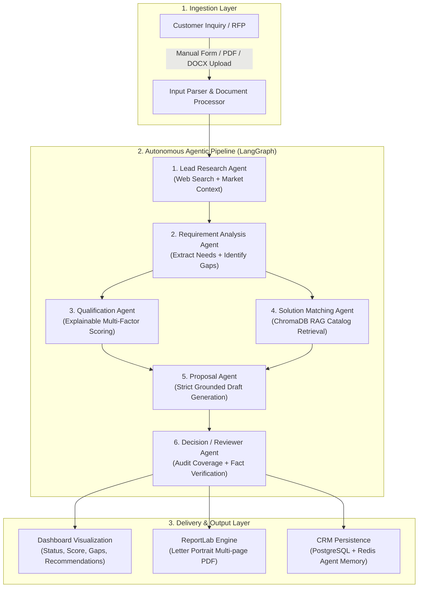

# Agentic AI Sales Lead Qualification & Proposal Generation System

[](https://github.com/Ranjith-7416/sales-ai)
[](https://sales-ai-ranjith-7416s-projects.vercel.app)
[](https://opensource.org/licenses/MIT)
[](https://sales-ai-etew.onrender.com)
[](https://sales-ai-ranjith-7416s-projects.vercel.app)

An end-to-end, enterprise-grade **Agentic AI Sales Lead Qualification & Proposal Generation Platform** designed to automate B2B presales operations. Presales and sales teams spend substantial time researching accounts, parsing unstructured RFPs, qualifying opportunities, matching client requirements against product portfolios, and assembling compliant commercial proposals. This system deploys **six specialized autonomous AI agents orchestrated via LangGraph** to handle the entire lead-to-proposal lifecycle with explainable scoring, strict zero-hallucination knowledge base grounding, and professional PDF proposal generation.

---

## 🌐 Live Deployments & Repository

| Resource | Target URL | Description |
| :--- | :--- | :--- |
| **Live Frontend App** | [https://sales-ai-ranjith-7416s-projects.vercel.app](https://sales-ai-ranjith-7416s-projects.vercel.app) | Production React + TypeScript + Tailwind UI hosted on Vercel CDN |
| **Live Backend API** | [https://sales-ai-etew.onrender.com](https://sales-ai-etew.onrender.com) | Production FastAPI service hosted on Render with PostgreSQL |
| **Interactive API Docs** | [https://sales-ai-etew.onrender.com/docs](https://sales-ai-etew.onrender.com/docs) | Swagger UI for interactive API exploration |
| **ReDoc Specifications** | [https://sales-ai-etew.onrender.com/redoc](https://sales-ai-etew.onrender.com/redoc) | Clean, responsive technical API documentation |
| **Health Check Endpoint** | [https://sales-ai-etew.onrender.com/health](https://sales-ai-etew.onrender.com/health) | Live system status & version monitor |
| **GitHub Repository** | [https://github.com/Ranjith-7416/sales-ai](https://github.com/Ranjith-7416/sales-ai) | Complete source code, automated test suites, and Docker configs |

### 🔑 Access & Authentication
- **Default Admin Account:** Configured via `ADMIN_EMAIL` and `ADMIN_PASSWORD` environment variables in your deployment environment.
- **Account Registration:** Self-service registration is available directly on the login page.
- **Password Reset:** Secured by server-side cryptographic 6-digit OTP verification delivered via SMTP.

---

## 🎯 Problem Statement & Core Objective

Sales organizations handle hundreds of inbound inquiries and complex RFPs every month. Manually vetting each inquiry results in slow response times, missed high-value opportunities, inconsistent qualification criteria, and inaccurate proposal claims.

### Real-World Example Scenario
> **Customer Inquiry:**  
> *"We need an AI-powered document processing solution capable of extracting information from approximately 10,000 PDF documents per month."*

The system automatically:
1. **Researches the prospective company** to extract business vertical, scale, and operational context.
2. **Extracts structured requirements** (functional, scale, performance SLAs, ISO/SOC2 compliance, budget, timeline) and pinpoints missing information.
3. **Calculates an explainable lead score** (0–100) and categorizes the lead into **Qualified**, **Needs More Information**, or **Low Priority**.
4. **Matches requirements against the Product & Service Knowledge Base (RAG)**, retrieving exact catalog capabilities (`DocumentAI Pro`) and calculating coverage percentage.
5. **Drafts a structured business proposal** strictly grounded in knowledge-base pricing and capabilities without inventing hallucinated claims.
6. **Audits the proposal via a Reviewer Agent**, verifying requirement coverage, flagging unverified claims, generating customer follow-up questions, and prescribing next actions.
7. **Generates an enterprise-ready PDF Proposal document** available for immediate client sharing and download.

---

## 🤖 Specialized AI Agents Architecture

The platform uses a modular, sequential-and-parallelized pipeline orchestrated using **LangGraph StateGraph**.



### Detailed Agent Breakdown

| Agent | Responsibility | Core Output |
| :--- | :--- | :--- |
| **1. Lead Research Agent** | Researches public company background, industry vertical, business model, and public web evidence via Brave/Serper/Mock fallback. | Company size, headquarters, market position, recent news, and public contact metadata. |
| **2. Requirement Analysis Agent** | Deeply analyzes customer text/files. Extracts functional requirements, technical constraints, scale metrics, and identifies missing information. | Structured functional requirements, non-functional requirements (scale, latency, security, compliance), and discovery gaps. |
| **3. Qualification Agent** | Evaluates the opportunity across 4 weighted dimensions using configurable rules and formulas. | Composite score (0–100), Fit score, Readiness score, Opportunity score, Risk score, and score drivers. |
| **4. Solution Matching Agent** | Queries ChromaDB vector store using semantic similarity & lexical matching against products and services catalog. | Matched products/services, capability mapping, coverage percentage, gaps, workarounds, and commercial estimates. |
| **5. Proposal Agent** | Generates a complete, structured commercial proposal. Strictly adheres to catalog evidence with zero invented pricing or SLAs. | Executive summary, implementation roadmap, pricing schedule, support tiers, success metrics, and next steps. |
| **6. Decision / Reviewer Agent** | Performs independent quality assurance and fact-checking. Validates requirement coverage and flags unsupported claims. | Requirement coverage audit, verified claim citations, risk matrix, customer follow-up questions, and recommended next actions. |

---

## 📊 Explainable & Configurable Lead Scoring Engine

The qualification score is **100% deterministic, explainable, and dynamically configurable** via the UI and API.

### Multi-Factor Scoring Formula
$$\text{Composite Score} = (w_{\text{fit}} \times S_{\text{fit}}) + (w_{\text{readiness}} \times S_{\text{readiness}}) + (w_{\text{opp}} \times S_{\text{opp}}) + (w_{\text{risk}} \times [100 - S_{\text{risk}}])$$

| Component | Default Weight | Metric Focus | Scoring Criteria |
| :--- | :---: | :--- | :--- |
| **Fit Score** | **25%** | Product/Capability Match | Degree to which customer needs match knowledge base products |
| **Readiness Score** | **25%** | Purchase Intent & Urgency | Defined timeline, active decision-makers, and clear urgency |
| **Opportunity Score** | **30%** | Commercial Value & Scale | Budget magnitude, processing volume (e.g. 10k docs/mo), company size |
| **Risk Score** | **20%** | Delivery & Compliance Risk | Inverted: High technical or compliance risk reduces overall score |

### Status Categorization Thresholds
- 🟢 **Qualified:** $\text{Composite Score} \ge 75$ (ready for proposal and sales engagement)
- 🟡 **Needs More Information:** $50 \le \text{Composite Score} < 75$ (or critical discovery gaps detected)
- 🔴 **Low Priority:** $\text{Composite Score} < 50$ (disqualified, personal inquiry, or extreme mismatch)

> ⚙️ **Dynamic Configuration:** Sales directors can click **Scoring Rules** in the dashboard to adjust weights and threshold cutoffs in real time via an interactive modal with live validation ($\sum w_i = 1.00$).

---

## 🛡️ Anti-Hallucination & Knowledge Grounding Guarantees

In accordance with strict enterprise presales requirements, the Proposal Agent is constrained by deterministic validators ([`proposal_validator.py`](backend/app/services/proposal_validator.py)):
1. **Catalog Integrity:** The agent cannot invent products, add-ons, or professional services not present in [`products.json`](backend/knowledge_base/products.json) or [`services.json`](backend/knowledge_base/services.json).
2. **Pricing Bounds:** Commercial quotes are bound directly to catalog pricing tiers. Unspecified amounts are marked `[TO BE CONFIRMED]`.
3. **Certification Guardrails:** ISO 27001, SOC 2 Type II, HIPAA, or GDPR compliance claims are only asserted if the matched catalog entry holds that certification.
4. **Audit Trail:** The Reviewer Agent inspects every sentence in the generated proposal and marks claims as `Verified (KB Reference)` or `Unverified`.

---

## 🖥️ Complete User Journey & Expected Output Alignment

The application covers the complete lifecycle from authentication to PDF export:

```
[Login / Register / OTP Reset] 
       │
       ▼
[Lead Ingestion Form] ─── (Manual entry or PDF/DOCX drag-and-drop)
       │
       ▼
[Real-Time Pipeline Execution] ─── (6 agents execute in orchestrated graph)
       │
       ▼
[Interactive Dashboard View]:
  ├── 1. Overview Tab: Radial Score Dial, Status Badge, Reasoning Narrative, Missing Info Callouts, 6 Context Blocks
  ├── 2. Research Tab: Account Intelligence, Industry, Market Position, Recent News
  ├── 3. Requirements Tab: Functional, Non-Functional (Scale, SLA, Security), Constraints, Priority Mapping
  ├── 4. Solution Tab: Matched Products/Services, Coverage %, Gaps & Workarounds, Commercial Valuation
  ├── 5. Proposal Tab: Grounded Proposal, Roadmap, Pricing, SLA, [Download Proposal PDF], [Export Markdown]
  └── 6. Review Tab: Coverage Validation, Verified Claims, Risk Assessment, Follow-up Questions, Next Steps
```

---

## 🛠️ Complete Technology Stack

### Backend
- **Python 3.11** - High-performance core runtime
- **FastAPI 0.104.1** - Modern, asynchronous REST API framework
- **LangGraph 0.2.28** - Stateful multi-agent graph orchestration
- **LangChain 0.2.x** - LLM abstraction and tool-calling utilities
- **ChromaDB 0.4.17** - Persistent vector database for RAG retrieval
- **ReportLab 4.x** - Professional multi-page PDF rendering engine
- **SQLAlchemy 2.0 & PostgreSQL** - CRM data persistence (with SQLite dev fallback)
- **Redis 7** - Distributed caching, rate-limiting, and agent memory
- **Pydantic 2.5** - Strict data validation and schema enforcement
- **PyPDF & python-docx** - Unstructured customer document processing

### Frontend
- **React 18.2** - Component-based user interface
- **TypeScript 5.2** - End-to-end type safety
- **Tailwind CSS 3.3** - Utility-first modern aesthetic styling
- **Vite 5.0** - Ultra-fast development and optimized production bundling
- **Lucide React** - Polished iconography
- **Axios** - HTTP client with unified auth interceptors

---

## 🚀 Local Development Setup

### Option 1: Docker Compose (Recommended)

1. **Clone the repository:**
   ```bash
   git clone https://github.com/Ranjith-7416/sales-ai.git
   cd sales-ai
   ```

2. **Start all services:**
   ```bash
   docker-compose up --build
   ```
   This launches:
   - PostgreSQL (port `5432`)
   - Redis (port `6379`)
   - FastAPI Backend (port `8000`)
   - Vite React Frontend (port `5173`)

### Option 2: Manual Local Execution

1. **Backend Setup:**
   ```bash
   cd backend
   python3 -m venv .venv
   source .venv/bin/activate
   pip install -r requirements.txt
   
   # Set environment configuration
   cp .env.example .env
   
   # Run local FastAPI server
   uvicorn app.main:app --host 0.0.0.0 --port 8001 --reload
   ```

2. **Frontend Setup:**
   ```bash
   cd frontend
   npm install
   npm run dev
   ```
   Open `http://localhost:3000` in your browser.

---

## 🧪 Verification & Automated Testing

The codebase includes comprehensive test suites across both backend and frontend layers:

```bash
# 1. Run all Backend Pytest Suites (109 passed)
cd backend
.venv/bin/pytest tests -v

# 2. Run Frontend Unit Tests (5 passed)
cd frontend
npm run test

# 3. Run Frontend Linter (0 warnings, 0 errors)
npm run lint

# 4. Compile Production Frontend Build (0 errors)
npm run build
```

---

## 📂 Repository Structure

```
sales-ai/
├── backend/
│   ├── app/
│   │   ├── main.py                     # FastAPI entry point, CORS, and routers
│   │   ├── config.py                   # Central settings, weights, and thresholds
│   │   ├── database.py                 # SQLAlchemy database session & engine
│   │   ├── models.py                   # Lead, Proposal, User, Token, & Memory models
│   │   ├── schemas.py                  # Pydantic input/output schemas
│   │   ├── security.py                 # JWT token generation & auth validation
│   │   ├── agents/                     # Specialized AI Presales Agents
│   │   │   ├── orchestrator.py         # LangGraph StateGraph pipeline coordinator
│   │   │   ├── research_agent.py       # Account & web research agent
│   │   │   ├── requirements_agent.py   # RFP requirement analysis agent
│   │   │   ├── qualification_agent.py  # Multi-factor qualification agent
│   │   │   ├── solution_agent.py       # Knowledge-base RAG matching agent
│   │   │   ├── proposal_agent.py       # Grounded proposal draft generator
│   │   │   └── reviewer_agent.py       # QA audit, claim verification, & next steps
│   │   ├── services/                   # Core business logic services
│   │   │   ├── scoring_engine.py       # Explainable qualification scoring algorithms
│   │   │   ├── rag_service.py          # ChromaDB vector store integration
│   │   │   ├── proposal_validator.py   # Anti-hallucination fact checking
│   │   │   ├── pdf_service.py          # ReportLab enterprise PDF generator
│   │   │   ├── email_service.py        # Secure 6-digit OTP delivery via SMTP
│   │   │   ├── document_processor.py   # PDF and DOCX text extractor
│   │   │   ├── llm_service.py          # Unified multi-provider LLM interface
│   │   │   └── web_search.py           # Web research integration
│   │   └── api/                        # REST endpoint controllers
│   │       ├── auth.py                 # Login, register, and 2-step OTP reset
│   │       ├── leads.py                # Lead submission, upload, and querying
│   │       ├── proposals.py            # Proposal approval, PDF streaming, export
│   │       ├── knowledge_base.py       # Product & service catalog management
│   │       └── config_api.py           # Dynamic scoring configuration
│   ├── knowledge_base/                 # Bundled RAG catalogs
│   │   ├── products.json               # Enterprise product catalog (DocumentAI Pro, etc.)
│   │   └── services.json               # Professional service & SLA catalog
│   ├── tests/                          # 110 automated pytest tests
│   └── requirements.txt                # Python dependencies
├── frontend/
│   ├── src/
│   │   ├── App.tsx                     # Top-level routing & layout
│   │   ├── config.ts                   # Centralized API URLs (Render/Vercel)
│   │   ├── components/                 # React UI components
│   │   │   ├── LoginPage.tsx           # Auth, Register, & 2-Step OTP Reset Wizard
│   │   │   ├── Dashboard.tsx           # 6-Tab Presales Console & PDF Modal
│   │   │   ├── InputForm.tsx           # Lead & RFP document upload form
│   │   │   ├── LeadsList.tsx           # Filterable CRM lead pipeline view
│   │   │   ├── ScoringConfigModal.tsx  # Dynamic weight/threshold configuration
│   │   │   └── KnowledgeBaseViewer.tsx # Catalog explorer & search
│   │   ├── context/                    # React Context (AuthContext)
│   │   ├── hooks/                      # Custom hooks (useApi, useLeadQualification)
│   │   └── types/                      # TypeScript definitions
│   ├── package.json                    # Node dependencies
│   ├── vite.config.ts                  # Vite build configuration
│   └── tailwind.config.js              # Custom styling & animations
├── docker-compose.yml                  # Multi-container local orchestration
├── DEPLOYMENT.md                       # Comprehensive deployment documentation
└── README.md                           # Master project documentation
```

---

## 📄 License
This project is licensed under the [MIT License](LICENSE).
